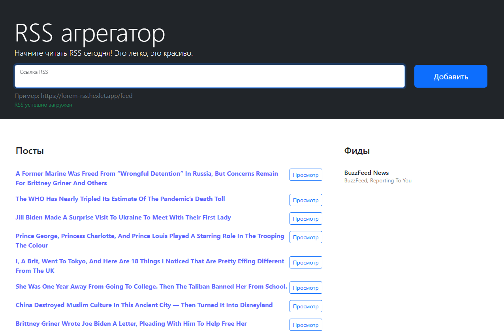

### Hexlet tests and linter status:

### Build status (include SonarQube):

# [RSS aggregator link](https://frontend-project-11-one-gamma.vercel.app/)

### Preview of project

You can add some links like [this](https://buzzfeed.com/world.xml) and you'll see links of posts with preview and opportunity go to post source.
RSS aggregator tracks new posts every 5 seconds.
